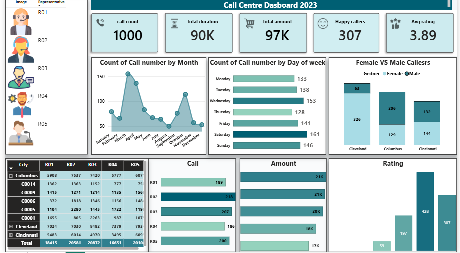
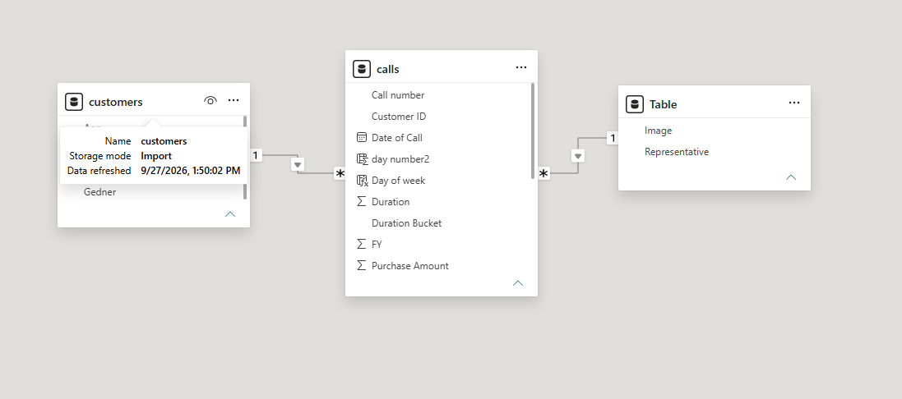

# 📞 Call Centre Performance Analysis | Power BI

An interactive Power BI dashboard analysing **1,000 customer calls across 3 cities (2023)** to track call volume, revenue, customer satisfaction and representative performance.

---

## 🖼️ Dashboard

---

## 📊 Key Metrics

| 📞 Calls | ⏳ Duration | 💰 Amount | 😊 Happy Callers | ⭐ Avg Rating |
|:---:|:---:|:---:|:---:|:---:|
| **1,000** | **90K** | **97K** | **307** | **3.89** |

---

## 🗂️ Data Model (Star Schema)

- **calls** (fact): call number, date, duration, purchase amount, rating
- **customers** (dimension): age, gender, city
- **Representatives** (dimension): name and image
- Relationships: one-to-many from `customers` and `Representatives` to `calls`

---

## 🎯 Business Questions Answered

- How do calls change by **month** and **day of week**?
- Which **city** and **gender** generate the most calls?
- How much **revenue** do calls bring in?
- How satisfied are customers?
- Which **representative** performs best?

---

## 💡 Key Insights

- **Peak month is April** (about 155 calls); **August is the lowest** (about 50).
- **Saturday is the busiest day** (161 calls); Thursday is the lowest (128).
- **Cleveland has the most callers** (389), then Columbus (335) and Cincinnati (276).
- Cleveland has mostly **female** callers (326 vs 63); Columbus is mostly **male** (206 vs 129).
- **R02 handles the most calls** (218). R01 and R02 earn the highest amount (about 21K each).
- **30.7% of callers are happy** and the average rating is **3.89**.

---

## ✅ Recommendations

- Add staff in **April, November and on Saturdays**.
- Use quiet months for **training and coaching**.
- Share the practices of top earners (R01, R02) with the rest of the team.
- Review low-rated calls to lift the average rating.

---

## 🛠️ Skills Demonstrated

Power Query data cleaning • Star schema modelling • DAX measures • Slicers and drill-down • Dashboard design • Business storytelling • Git and GitHub

---

## 👤 Author

**Shaikh Noman** | Aspiring Data Analyst
🔗 [GitHub](https://github.com/ShaikhNoman7397) • 💼 LinkedIn:https://www.linkedin.com/in/shaikhnoman7397/
